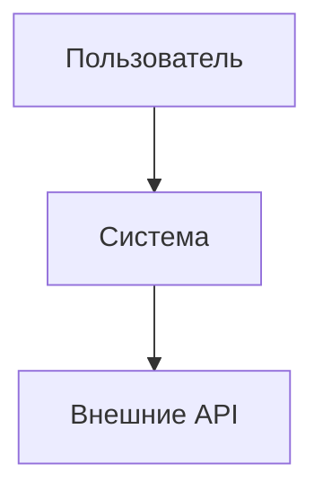
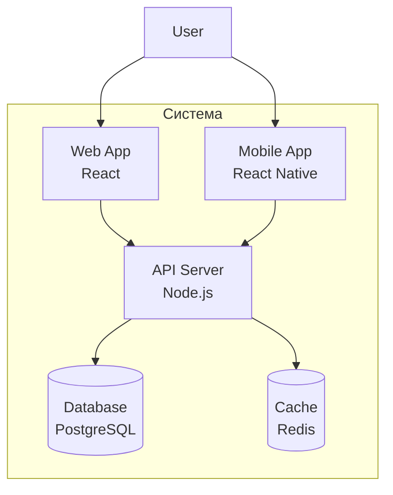
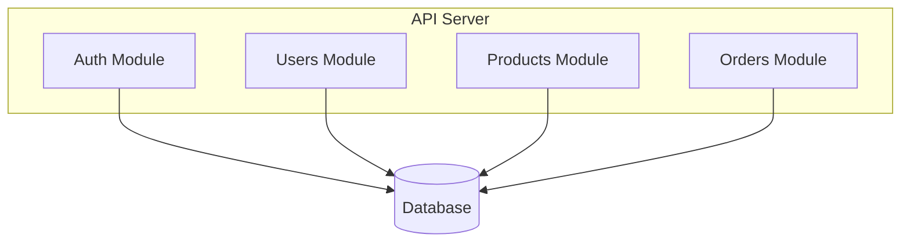
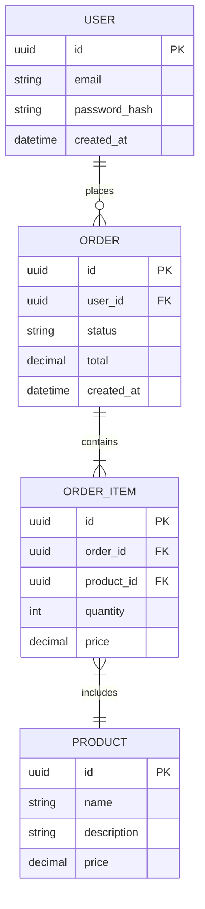

# System Design

**Проект:** [Название проекта]
**Версия:** [Номер версии]
**Дата:** [YYYY-MM-DD]
**Автор:** Architect

---

## Связь с ADR

Данный документ является графической иллюстрацией архитектурных решений, описанных в:
- [docs/architecture/ADR.md](../architecture/ADR.md)

---

## C4 Model

### Level 1: System Context

**Описание:**
[Кто использует систему, с чем она интегрируется]

---

### Level 2: Containers

**Описание контейнеров:**

| Контейнер | Технология | Назначение |
|-----------|-----------|------------|
| Web App | React | Веб-интерфейс |
| Mobile App | React Native | Мобильное приложение |
| API Server | Node.js | Бэкенд, бизнес-логика |
| Database | PostgreSQL | Хранение данных |
| Cache | Redis | Кэширование |

---

### Level 3: Components

**Описание компонентов:**

| Компонент | Модуль | Назначение |
|-----------|--------|------------|
| Auth | auth | Аутентификация, авторизация |
| Users | users | Управление пользователями |
| Products | products | Каталог продуктов |
| Orders | orders | Заказы |

---

## ER-диаграмма

---

## API Design

### Обзор эндпоинтов

| Метод | Путь | Описание |
|-------|------|----------|
| POST | /auth/login | Аутентификация |
| POST | /auth/register | Регистрация |
| GET | /users/me | Профиль пользователя |
| GET | /products | Список продуктов |
| GET | /products/:id | Детали продукта |
| POST | /orders | Создать заказ |
| GET | /orders | Список заказов |

### OpenAPI спецификация

Полная спецификация API: [docs/api/openapi.yaml](../api/openapi.yaml)

---

## Changelog

| Дата | Изменение | Автор |
|------|-----------|-------|
| YYYY-MM-DD | Initial version | Architect |
