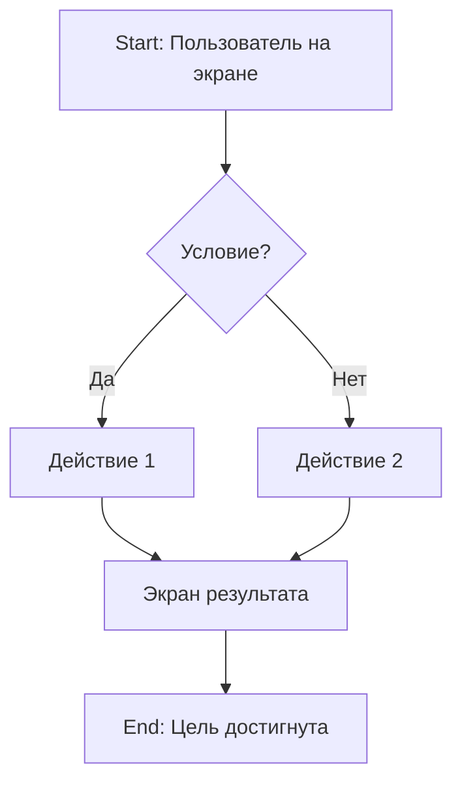

# User Flow: [Название потока]

**Дата:** [YYYY-MM-DD]
**Автор:** Designer

---

## Описание

[Краткое описание потока: что делает пользователь и зачем]

---

## Участники

- **Пользователь:** [роль пользователя]
- **Система:** [какие модули задействованы]

---

## Диаграмма потока

---

## Шаги потока

### 1. [Название шага]

**Экран:** [Название экрана] → `docs/ui-screens/[файл]`

**Действие пользователя:** [Что делает]

**Ответ системы:** [Что происходит]

---

### 2. [Название шага]

**Экран:** [Название экрана]

**Действие пользователя:** [Что делает]

**Ответ системы:** [Что происходит]

---

### 3. [Название шага]

[...]

---

## Варианты路径

### Успешный сценарий

1. Пользователь делает X
2. Система отвечает Y
3. Пользователь видит Z

### Альтернативный сценарий

1. Пользователь делает X
2. Возникает ошибка
3. Пользователь видит сообщение об ошибке

---

## Обработка ошибок

| Ошибка | Экран | Действие |
|--------|-------|----------|
| Нет соединения | Текущий экран | Показать toast с ошибкой |
| Неавторизован | Login | Редирект на страницу входа |

---

## Связь с фичами

- Фича: #[номер issue]
- PRD: docs/prd.md#[секция]
